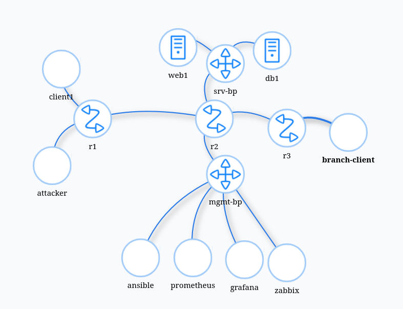

## 1. Johdanto

Tämän ympäristön tarkoitus on tutkia verkon toimintaa ja rakennetta. Ympäristö sisältää eri tyyppisiä laitteita: clienttejä, palvelimia, reitittimiä ja erilaisia hallintatyökaluja.

## 2. Verkkokaavio



## 3. Laiteluettelo

| Laite         | Tarkoitus                            |
| ------------- | ------------------------------------ |
| r1            | reititin                             |
| r2            | reititin                             |
| r3            | reititin                             |
| client1       | client                               |
| attacker      | client                               |
| web1          | palvelin                             |
| db1           | palvelin/tietokanta                  |
| branch-client | client                               |
| ansible       | hallinta/asennustyökalu palvelimille |
| prometheus    | monitorointityökalu                  |
| grafana       | datan visualisointi                  |
| zabbix        | monitorointityökalu                  |

## 4. IP-suunnitelma

| Verkko         | Tarkoitus                                       | Yhdyskäytävä |
| -------------- | ----------------------------------------------- | ------------ |
| 10.10.10.0/24  | clientit (client1 ja attacker1)                 | 172.20.20.1  |
| 10.10.20.0/24  | palvelimet (web1 ja db1)                        | 172.20.20.1  |
| 10.10.30.0/24  | branch client                                   | 172.20.20.1  |
| 10.10.99.0/24  | työkalut (ansible, prometheus, grafana, zabbix) |              |
| 10.255.12.0/30 |                                                 |              |
| 10.255.23.0/30 |                                                 |              |

## 5. Reitityksen analyysi

Pingaus ja traceroute client1 -> web1

```
$ docker exec -it clab-hamk-verkonhallinta-golden-client1 ping 10.10.20.101
PING 10.10.20.101 (10.10.20.101) 56(84) bytes of data.
64 bytes from 10.10.20.101: icmp_seq=1 ttl=62 time=0.112 ms
64 bytes from 10.10.20.101: icmp_seq=2 ttl=62 time=0.119 ms
64 bytes from 10.10.20.101: icmp_seq=3 ttl=62 time=0.163 ms
64 bytes from 10.10.20.101: icmp_seq=4 ttl=62 time=0.117 ms
^C
--- 10.10.20.101 ping statistics ---
4 packets transmitted, 4 received, 0% packet loss, time 3057ms

$ docker exec -it clab-hamk-verkonhallinta-golden-client1 traceroute -n 10.10.20.101
traceroute to 10.10.20.101 (10.10.20.101), 30 hops max, 60 byte packets
1 10.10.10.1 0.558 ms 0.497 ms 0.483 ms
2 10.255.12.2 0.463 ms 0.422 ms 0.398 ms
3 10.10.20.101 0.055 ms 0.019 ms 0.019 ms
```

Traceroute branch-client -> client1

```
$ docker exec -it clab-hamk-verkonhallinta-golden-branch-client traceroute -n 10.10.10.101
traceroute to 10.10.10.101 (10.10.10.101), 30 hops max, 60 byte packets
1 10.10.30.1 0.554 ms 0.485 ms 0.467 ms
2 10.255.23.1 0.453 ms 0.417 ms 0.395 ms
3 10.255.12.1 0.371 ms 0.336 ms 0.312 ms
4 10.10.10.101 0.288 ms 0.252 ms 0.219 ms
```

## 6. Yhteenveto

Pohdi:

- Mitkä asiat verkon dokumentaation muodostamisessa kuluttivat eniten aikaa ja miksi?
- Miten dokumentaatio mielestäsi auttaa palvelusta vastaavaa it-asiantuntijaa työssään?
