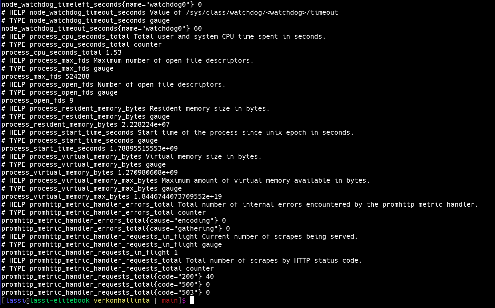
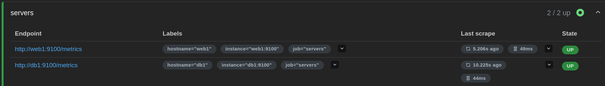
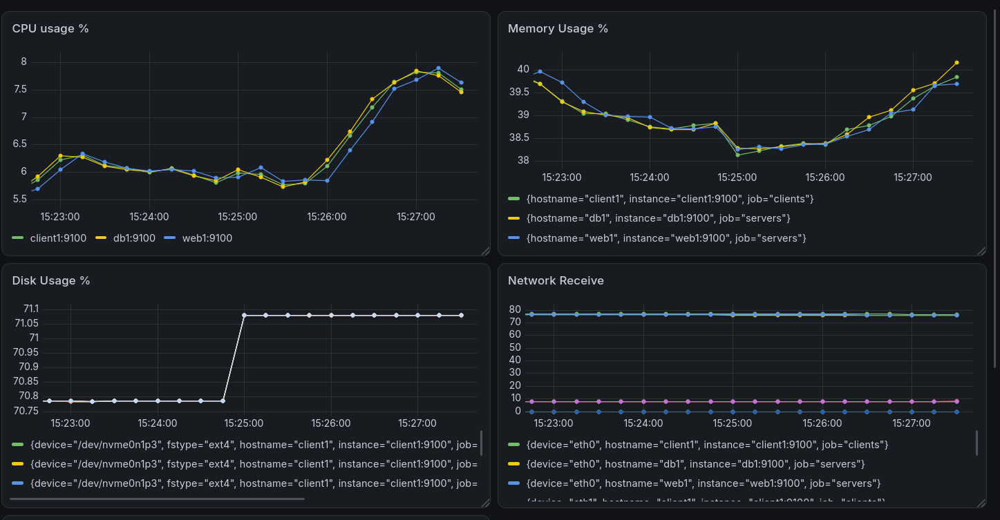

# 1. Johdanto

Prometheus on työkalu, jolla käyttäjä voi kerätä dataa palvelimilta. Tämä data voidaan "jalostaa" PromQL-kyselyillä, ja visualisoida helposti esimerkiksi Grafanalla. Prometheus tarjoaa muitakin ominaisuuksia, kuten hälytyksien lähettämisen admineille mikäli palvelimella on jokin vikatila.

# 2. Node Exporterin käyttöönotto

Node Exporter asennettiin web1-koneelle GitHubista lataamalla. Latauksen jälkeen ei tarvinut muokata mitään configuraatioita, vaan ohjelma oli valmis käytettäväksi.

# 3. Prometheus

Asennuksen jälkeen testasimme curl-komennolla että Prometheus toimii:

# 4. Dashboard

Koko dashboardilta emme tajunneet ottaa kuvakaappausta, mutta alla olevasta kuvasta näkyy että Prometheus saa yhteyden palvelimiin:

# 5. Kuormitustesti

Simuloimme kuormituksen luomista web1-palvelimella. Alla olevasta kuvasta näkyy että kuormitus luo piikin CPU:n ja levyn käyttöön, mutta nettiliikennekäyrä ei muutu, koska mitään dataa ei lähetetty verkon yli.

# 6. SNMP vs Prometheus

| Ominaisuus                     | SNMP                                   | Prometheus                  |
| ------------------------------ | -------------------------------------- | --------------------------- |
| Tiedonkeruu                    | Manuaalinen, hetkellinen               | Automaattinen, jatkuva      |
| Käyttöönotto                   | Yksinkertainen                         | Vaatii useamman vaiheen     |
| Mittarien määrä                | Paljon                                 | Paljon ja pari lisää        |
| Visualisointi                  | Ei (paitsi tekstinä, jos se lasketaan) | Työkalulla kuten Grafanalla |
| Hälytysmahdollisuudet          | Ei                                     | Kyllä                       |
| Soveltuvuus pilviympäristöihin |                                        |                             |

SNMP:llä kerättävä data on hetkellistä, ja manuaalisesti tehtävää. Prometheus hoitaa datan keruun automaattisesti ja tallentaa sen tietokantaan. Näin ollen käyttäjä voi tarkastella aiempia trendejä ja lukemia, kun taas SNMP:n data näyttää vain sen hetkisen tilanteen.

SNMP ja Prometheus tarjoavat suuren määrän eri mittareita palvelimien tilasta. Prometheus tarjoaa mahdollisuuden datan muuntamiseen mm. PromQL-kielellä, ja visuaalisointiin Grafanalla.

Prometheukselle voidaan asettaa hälytysjärjestelmiä jotka ilmoittavat poikkeustilanteista. Poikkeustilanne voi olla hetkellinen tapahtuma, tai tapahtua pitemmällä aikavälillä, esimerkiksi jos muistin ja/tai CPU:n käyttö on yli x% useamman minuutin tai tunnin ajan.

# 7. Yhteenveto

Prometheus on työkalu datan automaattiseen keräämiseen palvelimilta. Sen avulla käyttäjä voi tarkastella visuaalisesti palvelimien resurssienkäyttöä, kuten CPU:n, muistin tai verkon käyttöä. Prometheuksen käyttöönotto on melko suoraviivainen, eikä se vaadi suurempia konfiguraatioita palvelimen puolella.
